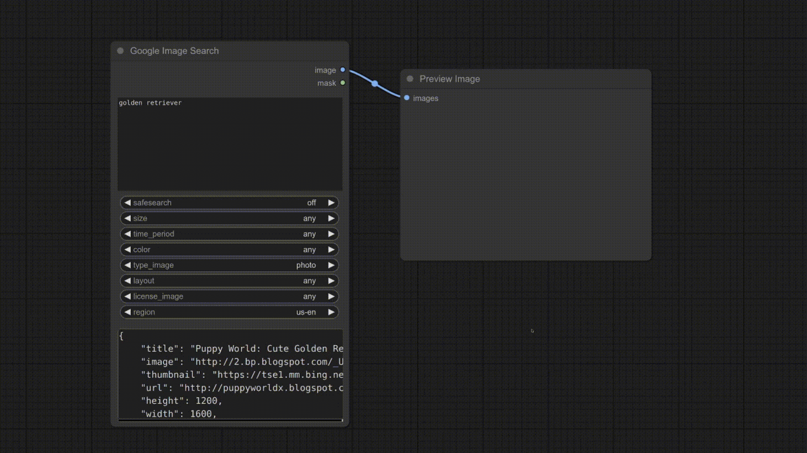

# Google Image Search ComfyUI Node

# Workflow Examples

## Goolge Image → Text (Caption) → Image

>
> 

> 
 Expand Picture 

> 
> 
>
> 

## Google Image → Text (Caption) → Color → Image

>
> 

> 
 Expand Picture 

> 
> 
>
> 

> 
> 

> 
 Expand Picture 

>
> 
>
> 

# Requirements

- fastcore>=1.5.29
- fastdownload>=0.0.7
- duckduckgo_search>=5.2.1

# Installation

- `cd` into `ComfyUI/custom_nodes` directory
- `git clone` this repository
- `cd` into the repository
- `pip install -r requirements.txt`

--------------